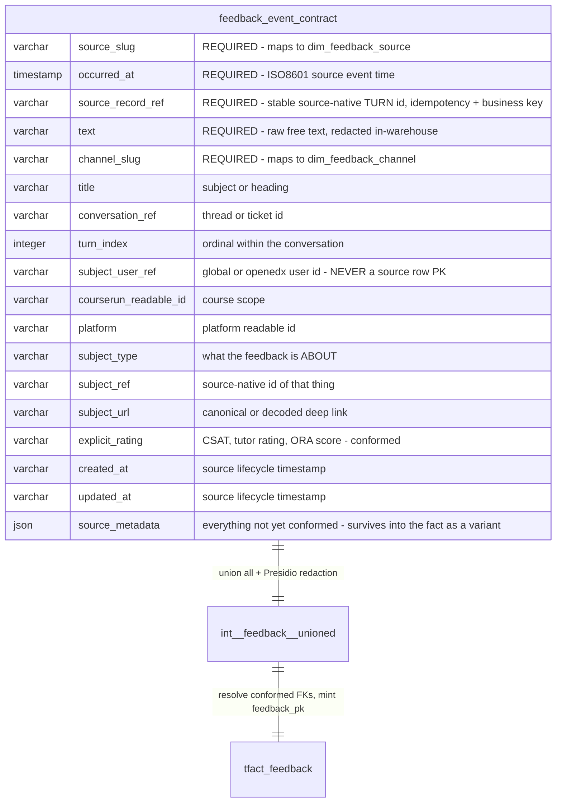
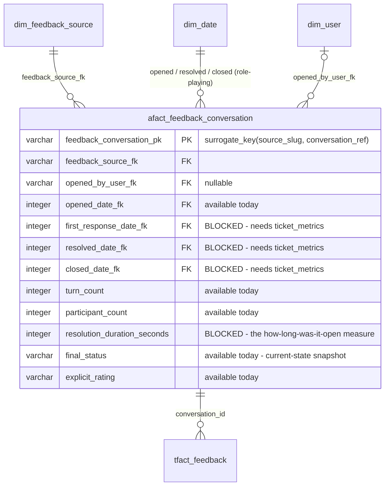
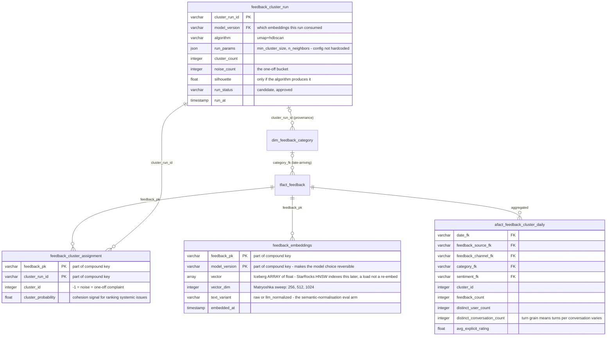
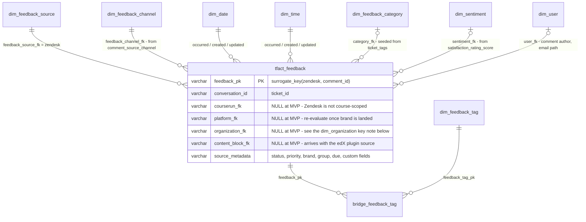
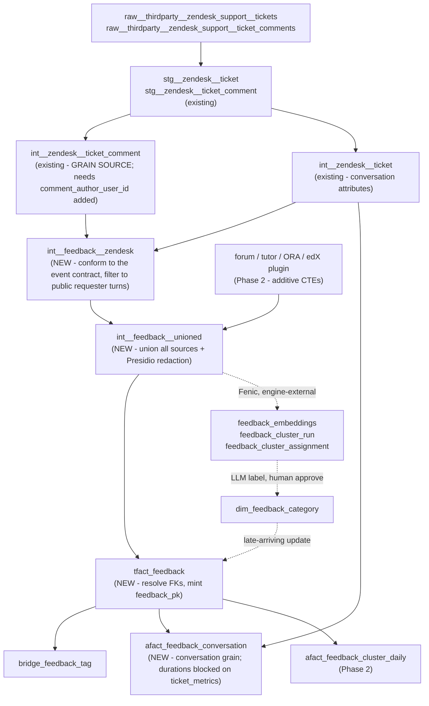

# Feedback Aggregation — Entity-Relationship Diagrams

Status: **spec** · Project: `wp-feedback-aggregation-clustering-system-2e9750`
Date: 2026-08-07 (rev. 2 — turn grain + conformance rule) · Companion to
[`feedback_dimensional_model.md`](./feedback_dimensional_model.md),
[`feedback_event_contract_spec.md`](./feedback_event_contract_spec.md) and
[`feedback_ml_approach.md`](./feedback_ml_approach.md).

Visual counterpart to the column lists in the specs above, so the schema is reviewable as a shape rather
than as prose. Also posted as an addendum on
[RFC mitodl/hq#12210](https://github.com/mitodl/hq/discussions/12210#discussioncomment-17935060).

**Reading the diagrams:** `||--o{` = required FK (never null). `|o--o{` = **nullable** FK — sparse
conformance is the flexibility mechanism, so most of the star is deliberately optional.

---

## 0. The conformance rule

Everything below follows from one rule, adopted after review feedback on
[#2422](https://github.com/mitodl/ol-data-platform/pull/2422) and
[RFC #12210](https://github.com/mitodl/hq/discussions/12210#discussioncomment-17937328):

> **An attribute earns a column on the fact, or a conformed dimension, only if two or more sources can
> populate it.** Everything else lives in the `source_metadata` variant column, and is promoted to a real
> column if and when a second source starts supplying it.

`tfact_feedback` exists to aggregate Zendesk *plus* edX forum, Learn AI tutor, ORA and the edX feedback
plugin. Shaping the core tables around what Zendesk happens to expose makes every later source pay for it.
Applying the rule is what produced the attribute placement in §1 and the withdrawals in §6.

**Promotion path** (so the variant does not become a dumping ground): when a second source begins populating
a key inside `source_metadata`, promote it to a real column or a conformed dimension **in the same change
that onboards that source** — not later, and not speculatively in advance.

---

## 1. Target star schema — `tfact_feedback` and its dimensions

```mermaid
erDiagram
    dim_feedback_source   ||--o{ tfact_feedback : "feedback_source_fk"
    dim_feedback_channel  ||--o{ tfact_feedback : "feedback_channel_fk"
    dim_date              ||--o{ tfact_feedback : "occurred / created / updated (role-playing)"
    dim_time              ||--o{ tfact_feedback : "occurred / created / updated (role-playing)"
    dim_feedback_category |o--o{ tfact_feedback : "category_fk (late-arriving)"
    dim_sentiment         |o--o{ tfact_feedback : "sentiment_fk (late-arriving)"
    dim_user              |o--o{ tfact_feedback : "user_fk (identity: highest-risk join)"
    dim_platform          |o--o{ tfact_feedback : "platform_fk"
    dim_course_run        |o--o{ tfact_feedback : "courserun_fk (course-scoped sources)"
    dim_course_content    |o--o{ tfact_feedback : "content_block_fk (what it is about)"
    dim_organization      |o--o{ tfact_feedback : "organization_fk"
    tfact_feedback        ||--o{ bridge_feedback_tag : "feedback_pk"
    dim_feedback_tag      ||--o{ bridge_feedback_tag : "feedback_tag_pk"
    afact_feedback_conversation ||--o{ tfact_feedback : "conversation_id (turns roll up)"

    tfact_feedback {
        varchar feedback_pk PK "surrogate_key(source_slug, source_record_ref) - ref is the TURN id"
        varchar feedback_source_fk FK "required"
        varchar feedback_channel_fk FK "required - conformed; every source has a channel"
        varchar user_fk FK "nullable - anonymous or unresolved author"
        varchar platform_fk FK "nullable"
        varchar courserun_fk FK "nullable - Zendesk is not course-scoped"
        varchar content_block_fk FK "nullable - resolves subject_ref for edX blocks"
        varchar organization_fk FK "nullable"
        varchar category_fk FK "nullable at insert - ML or seed fills later"
        varchar sentiment_fk FK "nullable at insert - rating or model fills later"
        integer occurred_date_fk FK "required - role-playing on the utterance timestamp"
        integer occurred_time_fk FK "required"
        integer created_date_fk FK "role-playing"
        integer created_time_fk FK "role-playing"
        integer updated_date_fk FK "role-playing"
        integer updated_time_fk FK "role-playing"
        varchar conversation_id "degenerate - ticket_id, chatsession_thread_id, forum thread"
        integer turn_index "ordinal of this turn within the conversation"
        boolean is_conversation_opening "first-turn-only becomes a filter, not a grain"
        varchar source_record_id "degenerate - the TURN business key (comment_id, checkpoint_id)"
        varchar source_url "degenerate - unique per row, deep link back to origin"
        varchar subject_type "courseware_block, course_run, course, program, page_url, resource, unspecified"
        varchar subject_ref "source-native id of the thing the feedback is about"
        varchar subject_url "canonical or decoded deep link to that thing"
        varchar feedback_title "REDACTED"
        varchar feedback_text "REDACTED - raw text never lands in the fact"
        integer feedback_text_chars "pre-redaction length metric"
        varchar explicit_rating "conformed - Zendesk CSAT, tutor rating, ORA score"
        varchar source_metadata "VARIANT - JSON string; status, priority, brand, group, due, custom fields"
        timestamp feedback_occurred_at "the utterance itself"
        timestamp feedback_created_at
        timestamp feedback_updated_at
        timestamp feedback_ingested_at
    }

    dim_feedback_source {
        varchar feedback_source_pk PK "surrogate_key(source_slug)"
        varchar source_slug UK "zendesk, edx_forum, learn_ai_tutor, ora, edx_feedback_plugin"
        varchar source_name
        varchar source_medium "support_ticket, forum_post, chat, assessment, in_product"
        varchar source_audience_scope "operational, course, strategic"
        boolean is_course_scoped
        boolean is_conversational "does this source have multi-turn conversations"
    }

    dim_feedback_channel {
        varchar feedback_channel_pk PK "surrogate_key(channel_slug)"
        varchar channel_slug UK "email, web_form, in_product_widget, chat, forum_post, assessment, api"
        varchar channel_name
        boolean is_solicited "did we ask for it, or did they volunteer it"
    }

    dim_feedback_category {
        varchar feedback_category_pk PK "surrogate_key(category_slug)"
        varchar category_slug UK "stable machine key - survives relabelling"
        varchar category_label "LLM-proposed, human-approved"
        varchar category_parent_slug "optional hierarchy: cluster to category to theme"
        varchar category_status "proposed, approved, merged, deprecated"
        varchar category_source "seed, llm_discovered, manual"
        varchar cluster_run_id "provenance: which run proposed this category"
        timestamp first_seen_at
        timestamp updated_at
    }

    dim_sentiment {
        varchar sentiment_pk PK "surrogate_key(sentiment_slug)"
        varchar sentiment_slug UK "positive, neutral, negative"
        varchar polarity_score_bucket "coarse bucket for trend rollups"
    }

    dim_feedback_tag {
        varchar feedback_tag_pk PK "surrogate_key(source_slug, tag_slug)"
        varchar tag_slug "tags are source-scoped, not global"
        varchar tag_label
        varchar source_slug FK "which source system uses this tag"
    }

    bridge_feedback_tag {
        varchar feedback_pk PK "part of compound key"
        varchar feedback_tag_pk PK "part of compound key"
    }
```



Two dimensions are conformed-by-construction (`dim_feedback_source`, `dim_feedback_channel`), two are
derived and source-agnostic (`dim_feedback_category`, `dim_sentiment`), one is explicitly source-scoped
(`dim_feedback_tag`). `dim_user`, `dim_platform`, `dim_course_run`, `dim_organization`,
`dim_course_content` and `dim_date`/`dim_time` are reused as-is.

### Why these attributes and not others

Every attribute was audited against all five sources before being given a home:

| Attribute | Zendesk | forum | tutor | ORA | plugin | Home |
|---|:-:|:-:|:-:|:-:|:-:|---|
| channel / medium | ✓ | ✓ | ✓ | ✓ | ✓ | **`dim_feedback_channel`** |
| explicit rating | ✓ | ✗ | ✓ | ✓ | ✓ | **`explicit_rating`** measure on the fact |
| turn index | ✓ | ✓ | ✓ | ✗ | ✗ | **`turn_index`** degenerate |
| conversation ref | ✓ | ✓ | ✓ | ✗ | ✗ | **`conversation_id`** degenerate |
| subject (what it is about) | ~ | ✓ | ✓ | ✓ | ✓ | **`subject_*`** + `content_block_fk` |
| created / updated | ✓ | ✓ | ✓ | ✓ | ✓ | **role-playing date/time FKs** |
| tags | ✓ | ~ | ✗ | ✗ | ? | **`bridge_feedback_tag`** (source-scoped) |
| status | ✓ | ✗ | ✗ | ✗ | ✗ | `source_metadata` |
| priority | ✓ | ✗ | ✗ | ✗ | ✗ | `source_metadata` |
| brand | ✓ | ✗ | ✗ | ✗ | ✗ | `source_metadata` |
| group | ✓ | ✗ | ✗ | ✗ | ✗ | `source_metadata` |
| due date | ✓ | ✗ | ✗ | ✗ | ✗ | `source_metadata` |

### `source_metadata` — how the variant is actually stored

Iceberg v2 has **no native JSON type**, so the repo's established pattern is to persist JSON as a
**varchar containing a JSON string** — written with `json_format(...)`, read with the cross-db
`json_query_string` / `json_extract_value` macros in `src/ol_dbt/macros/cross_db_functions.sql`, which
already dispatch across Trino / DuckDB / StarRocks. In-repo precedent: `dim_course_content.block_metadata`
("a JSON string representing the metadata field… different block types may have different member fields").

StarRocks has a native JSON type and the read macros already target it, so the eventual migration is a
column-type change, not a redesign.

---

## 2. Grain — one row per turn

**`tfact_feedback` = one row per atomic free-text utterance, where an utterance is one *turn* of a
conversation** — not one conversation.

| Source | One row = | Text column | `source_record_ref` | `conversation_ref` |
|---|---|---|---|---|
| Zendesk | one **public, requester-authored comment** | `comment_plain_body` | `comment_id` | `ticket_id` |
| edX forum | one `*.created` post / response / comment | `post_content` | `post_id` | thread id |
| Learn AI tutor | one human turn | `human_message` | `checkpoint_id` | `chatsession_thread_id` |
| ORA | one feedback submission | `feedback_text` | `submission_uuid` | n/a |
| edX plugin | one feedback event | `feedback_text` | plugin event id | n/a |

Turn grain is what the other sources already do: `int__learn_ai__chatbot` is one row per
`djangocheckpoint` (ordered by `checkpoint_step`), and the forum sources are one row per tracking-log
event. Zendesk at ticket grain was the only outlier, and it was an outlier in the Zendesk-shaped direction
the §0 rule exists to prevent.

**Exclusions are stated per source as one consistent rule — the author must be the person giving feedback,
not the platform answering:** Zendesk keeps `comment_is_public = true` and author = requester (drops
internal notes and agent replies); tutor keeps `human_message` and drops `agent_message`; forum keeps
`*.created` and drops view/vote/follow events.

`is_conversation_opening` recovers the previous first-comment-only view as a `WHERE` clause, so nothing is
lost by widening the grain.

---

## 3. Common event contract → the fact



`source_metadata` is no longer flattened into Zendesk-shaped facet columns at the fact boundary — it is
carried through **as a variant**, which is what makes a new source additive rather than a schema change.

---

## 4. Conversation lifecycle — `afact_feedback_conversation`

At turn grain, conversation-level attributes (status, priority, due date, CSAT, resolution time) repeat
across every row of a conversation. They belong to a different grain, so they get their own table: an
**accumulating-snapshot fact at conversation grain**, following the repo's `afact_` prefix for
non-transactional facts.



**Partially blocked on ingestion.** The Zendesk streams landed in the lake
(`src/ol_dbt/models/staging/zendesk/_zendesk__sources.yml`) are exactly seven:

```
tickets · ticket_comments · ticket_fields · brands · groups · organizations · users
```

`solved_at`, `closed_at`, `initially_assigned_at`, `first_resolution_time` and `full_resolution_time` live
in Zendesk's **`ticket_metrics`** endpoint; full state history lives in **`ticket_audits`**. Neither is
synced. In the `tickets` stream, "solved"/"closed" appear only as *values of `ticket_status`* — a snapshot
with no history.

So this table ships with `turn_count`, `participant_count`, `opened_date_fk`, `final_status` and
`explicit_rating` now, and the duration measures land once `ticket_metrics` is added to the connector —
an ingestion ticket, tracked separately. The grain does not move when they arrive.

---

## 5. ML sidecar — embeddings, cluster runs, categories



`dim_feedback_category` is the *curated, stable* projection; `feedback_cluster_*` is the *churny* ML working
set. Only an approved run advances the dimension — that decoupling is what lets clustering re-run freely.

**Turn grain changes the ML volumes.** The record count is now public-requester *comments*, not tickets.
Embedding cost scales linearly and stays small at these magnitudes, but the multiplier must be measured
before committing (see §7). Turn grain also *helps* clustering: a follow-up complaint in turn 4 of a ticket
is currently invisible, because only the first comment is embedded.

---

## 6. What Phase 1 (Zendesk MVP) builds



Build path:



**MVP cost check.** This moves Phase 1 from 3 new dimensions to **4 dimensions + 1 bridge + 1 conversation
fact**. All of the additions are `select distinct` cheap (`dim_feedback_channel`, `dim_feedback_tag`) or a
straight aggregation (`afact_feedback_conversation`), so the build cost is small — but it is a real increase
and worth confirming deliberately. The argument for paying it now: reshaping a fact after it has consumers
is the expensive version, and the grain change in §2 has to land before the fact ships regardless, because
it moves the business key.

---

## 7. Prerequisites and open items

| Item | Kind | Blocks |
|---|---|---|
| Carry `comment_author_user_id` through `int__zendesk__ticket_comment` (it is in `stg__zendesk__ticket_comment`, not in the int model) | small dbt change | classifying requester-vs-agent turns; `user_fk` resolution |
| Measure public-requester comment volume per ticket | measurement | sizing the fact and the embedding budget |
| Add the `ticket_metrics` stream to the Zendesk Airbyte connector | ingestion, separate ticket | resolution/closure durations in `afact_feedback_conversation` |
| Confirm the conformed `channel_slug` value set against each source's actual channel values | modeling | `dim_feedback_channel` seed |
| `dim_organization.organization_pk = generate_surrogate_key(['platform','source_id'])` (`dim_organization.sql:38`) — Zendesk supplies neither | known-null, explicit decision | `organization_fk` for Zendesk stays null; org rides in `source_metadata` |

---

## 8. Change log

**rev. 2 (2026-08-07)** — from [@KatelynGit's RFC
review](https://github.com/mitodl/hq/discussions/12210#discussioncomment-17937328) and the conformance rule
in §0:

- **Grain moved from ticket to turn.** Zendesk `source_record_ref` is now `comment_id`, `conversation_ref`
  is `ticket_id`. Added `turn_index` and `is_conversation_opening`.
- **Adopted the ≥2-sources conformance rule** (§0) and re-audited every attribute against it.
- **Added `dim_feedback_channel`** — the one attribute in the withdrawn junk dimension that is genuinely
  conformed.
- **Added `afact_feedback_conversation`** — conversation-grain lifecycle, partially blocked on ingestion.
- **Added `dim_feedback_tag` + `bridge_feedback_tag`** — replaces the multi-valued `source_tags` array.
- **Renamed** `date_fk`/`time_fk` → `occurred_date_fk`/`occurred_time_fk`; **added** created/updated
  role-playing FKs and timestamps.
- **`source_metadata` is now persisted as a variant on the fact** rather than flattened into facet columns.
- **Withdrawn:** the `dim_feedback_context` junk dimension proposed in rev. 1 — it was Zendesk-shaped and
  fails the §0 rule. **Withdrawn:** the `source_brand` / `source_group` facet columns added for
  [hq#12607](https://github.com/mitodl/hq/issues/12607) — same reason; both fields remain available and
  filterable from `source_metadata`. **Withdrawn:** `due_date_fk` — Zendesk-only, so it lives in the variant.

**rev. 1 (2026-08-07)** — initial ERDs; subject reference (`subject_type`/`subject_ref`/`subject_url` +
`content_block_fk`) from [@pdpinch's
review](https://github.com/mitodl/ol-data-platform/pull/2422#issuecomment-5169778966); ML sidecar grain
split into `feedback_embeddings` / `feedback_cluster_run` / `feedback_cluster_assignment`, dropping
`embedding_id` from the fact.
