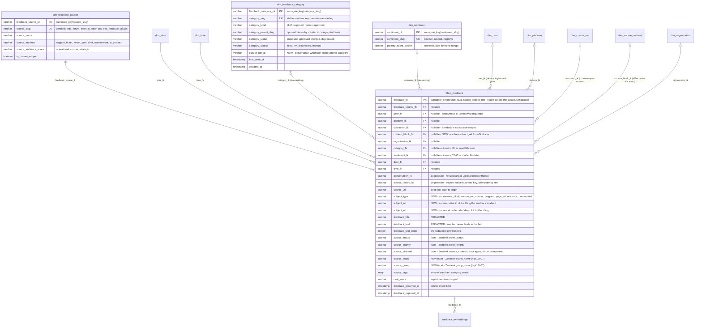
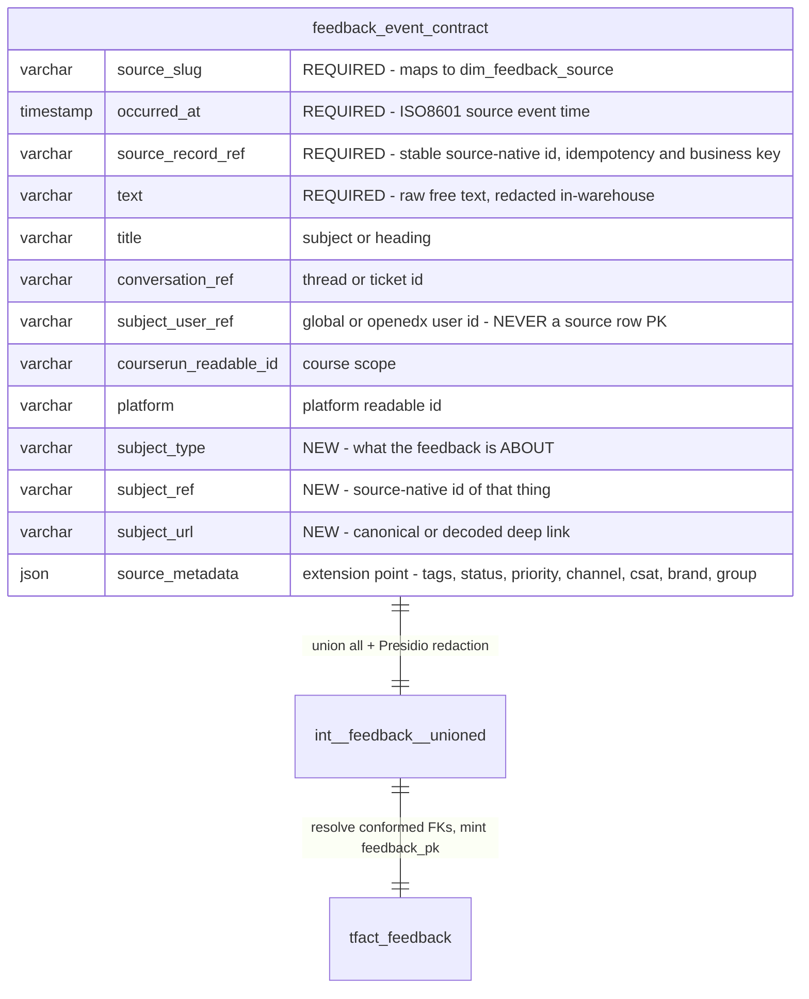
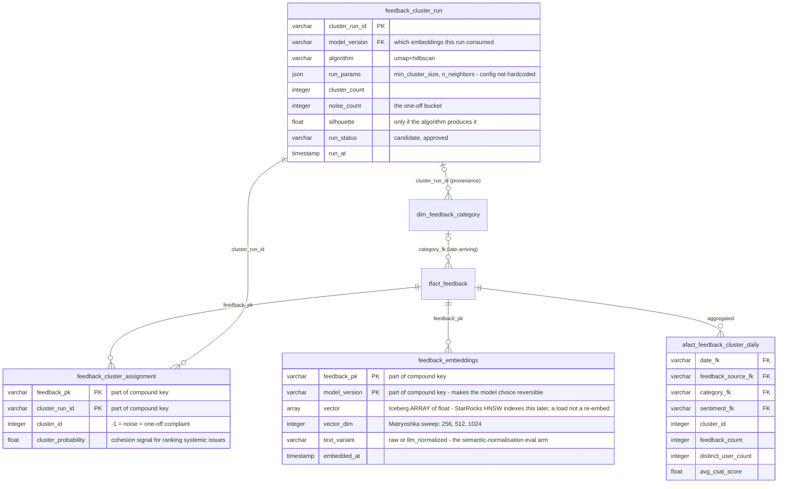
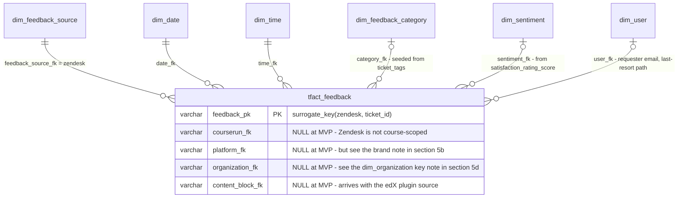
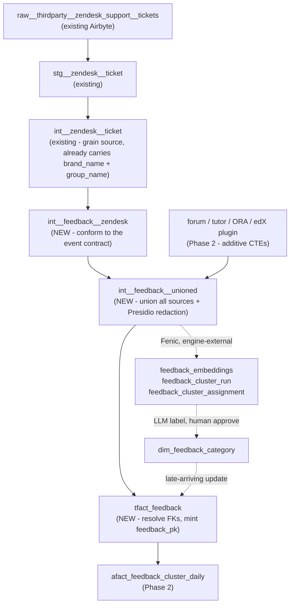

# Feedback Aggregation — Entity-Relationship Diagrams

Status: **spec** · Project: `wp-feedback-aggregation-clustering-system-2e9750`
Date: 2026-08-07 · Companion to [`feedback_dimensional_model.md`](./feedback_dimensional_model.md),
[`feedback_event_contract_spec.md`](./feedback_event_contract_spec.md) and
[`feedback_ml_approach.md`](./feedback_ml_approach.md).

Visual counterpart to the column lists in the specs above, so the schema is reviewable as a shape rather
than as prose. Also posted as an addendum on
[RFC mitodl/hq#12210](https://github.com/mitodl/hq/discussions/12210#discussioncomment-17935060).

Drawing the model surfaced three schema changes — two from review feedback on
[#2422](https://github.com/mitodl/ol-data-platform/pull/2422), one from the diagram itself. They are applied
in the diagrams below and in the companion specs; §5 records what changed and why.

**Reading the diagrams:** `||--o{` = required FK (never null). `|o--o{` = **nullable** FK — sparse
conformance is the flexibility mechanism (`feedback_dimensional_model.md` §2), so most of the star is
deliberately optional.

---

## 1. Target star schema — `tfact_feedback` and its dimensions

The three new dimensions are the only new dimensional work. `dim_user`, `dim_platform`, `dim_course_run`,
`dim_organization`, `dim_course_content` and `dim_date`/`dim_time` are reused as-is.

---

## 2. Common event contract → the fact

The contract is the durable artifact (RFC Option 3): every producer presents this shape at the
`stg__…__feedback` / `int__feedback__<source>` boundary, so the fact is indifferent to which pipe delivered
the row.

Per source:

| Source | `source_record_ref` | `subject_type` / `subject_ref` |
|---|---|---|
| Zendesk (agent/web) | `ticket_id` | `course_run` / course readable id from ticket metadata, where present |
| Zendesk (Appzi) | `ticket_id` | `page_url` / **decoded** Appzi URL (decoding is the adapter's job, §5a) |
| edX forum | `post_id` | `courseware_block` / usage key of the discussion block |
| Learn AI tutor | `thread_id` + `checkpoint_pk` | `course_run` / `courserun_readable_id` |
| ORA | `submission_uuid` | `courseware_block` / ORA block usage key |
| edX feedback plugin | plugin-native event id | `courseware_block` / block usage key |

---

## 3. ML sidecar — embeddings, cluster runs, categories

`dim_feedback_category` is the *curated, stable* projection; `feedback_cluster_*` is the *churny* ML working
set. Only an approved run advances the dimension — that decoupling is what lets clustering re-run freely.

---

## 4. What Phase 1 (Zendesk MVP) actually builds

~198K rows, one batch. No ML required for the fact to be useful.

Build path:

---

## 5. Schema deltas introduced with these diagrams

### 5a. "What is the feedback *about*?" — `subject_type` / `subject_ref` / `subject_url` + `content_block_fk`

Raised by @pdpinch on [#2422](https://github.com/mitodl/ol-data-platform/pull/2422#issuecomment-3157271372).
The contract had *who* said it, *when*, and *in what conversation*, but no unambiguous slot for what it
concerns — which is precisely the axis you aggregate on. Named cases: the edX feedback plugin captures the
courseware block id; some Zendesk tickets carry course metadata; Appzi-originated tickets capture the URL the
user was viewing (encoded).

Deliberately **not** a new `dim_feedback_subject`: the subject is polymorphic across dimensions that already
exist — a block is `dim_course_content`, a run is `dim_course_run`, a program is `dim_program`. A new dim
would shadow them. Instead:

- `subject_type` / `subject_ref` / `subject_url` are a degenerate triple on the contract and the fact — the
  universal fallback that always works, including for URLs and unresolvable references.
- Resolve to a conformed FK where one exists. `courserun_fk` already covers the course-run case; the only
  new conformed join needed is **`content_block_fk → dim_course_content.content_block_pk`**, the existing
  SCD for Open edX blocks (courses, chapters, subsections, problems, videos) that `tfact_problem_events` and
  `tfact_course_navigation_events` already use. edX-plugin and ORA feedback therefore lands in the courseware
  star with zero new dimensional work.
- **Appzi URL decoding belongs in `int__feedback__zendesk`**, populating `subject_url`/`subject_ref` — not in
  every consumer's query.

### 5b. Zendesk brand and group as first-class facets

Raised by @pdpinch citing [hq#12607](https://github.com/mitodl/hq/issues/12607). Cheap:
`int__zendesk__ticket` already carries `brand_name` and `group_name` (joined from `stg__zendesk__brand` /
`stg__zendesk__group`). Carry both in `source_metadata` at the contract boundary and project them to
`source_brand` / `source_group` facet columns on the fact, so Superset filters on a plain varchar rather than
a JSON extract.

Worth evaluating during implementation: Zendesk **brand** is effectively "which help centre / product the
ticket came in through", the closest thing Zendesk has to a platform. If brands map cleanly onto
`dim_platform`, `platform_fk` need not be null for Zendesk after all.

### 5c. Sidecar grain split

`feedback_ml_approach.md` §A put vectors and cluster assignments in one `feedback_embeddings` table, but they
have **different grains**: a vector is one per `(feedback_pk, model_version)`; a cluster assignment is one per
`(feedback_pk, cluster_run_id)`. Re-clustering against an unchanged model would rewrite or duplicate vector
rows — losing the "re-clustering never touches the durable artifact" property the design is buying. Split
into `feedback_embeddings` / `feedback_cluster_run` / `feedback_cluster_assignment` as drawn in §3.

Two consequences:

- `dim_feedback_category` gains a `cluster_run_id` provenance column — trace a category back to the run that
  proposed it.
- The fact's `embedding_id` column is **dropped**. The sidecar is keyed by `feedback_pk`, so `embedding_id`
  adds no reachability and would mean writing to the fact when embeddings land.

### 5d. Known-null FK, flagged rather than discovered later

`dim_organization.organization_pk = generate_surrogate_key(['platform', 'source_id'])`
(`src/ol_dbt/models/dimensional/dim_organization.sql:38`). Zendesk has neither, so `organization_fk` cannot
resolve for Zendesk tickets under the current key. It stays null at MVP and the Zendesk organisation/group is
carried as a facet instead. Either that is acceptable, or `dim_organization` needs a Zendesk-aware alternate
key — a decision worth making explicitly rather than by omission.

---

Unchanged by all of the above: the business-key strategy
(`feedback_pk = generate_surrogate_key([source_slug, source_record_ref])`), so the interim → data-bus
migration is still "swap source + backfill + parity".
